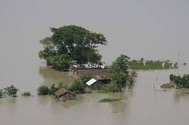
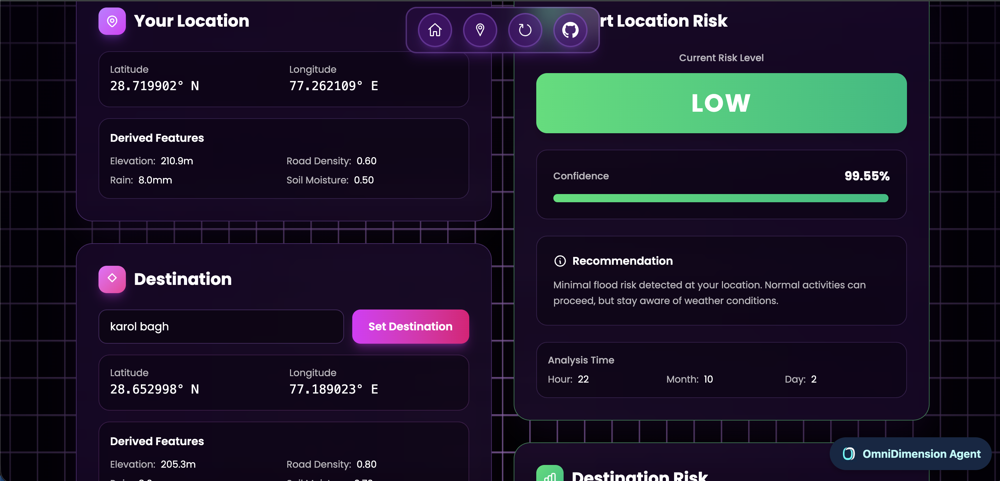
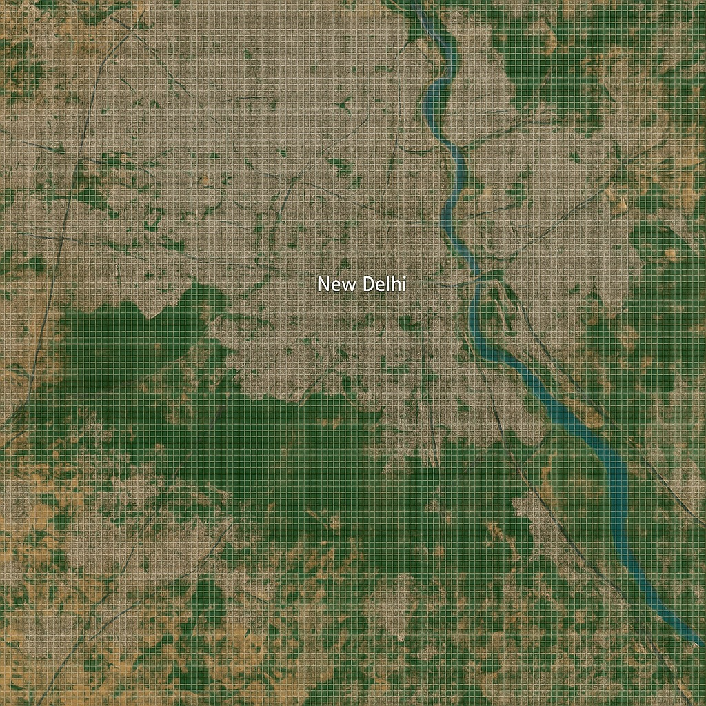
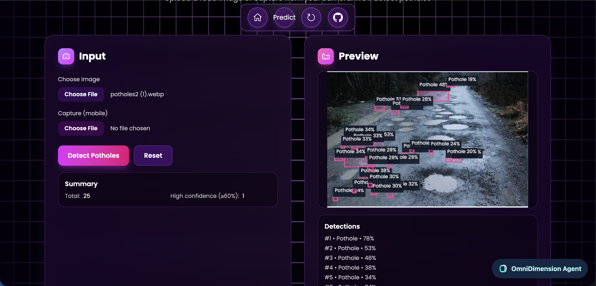
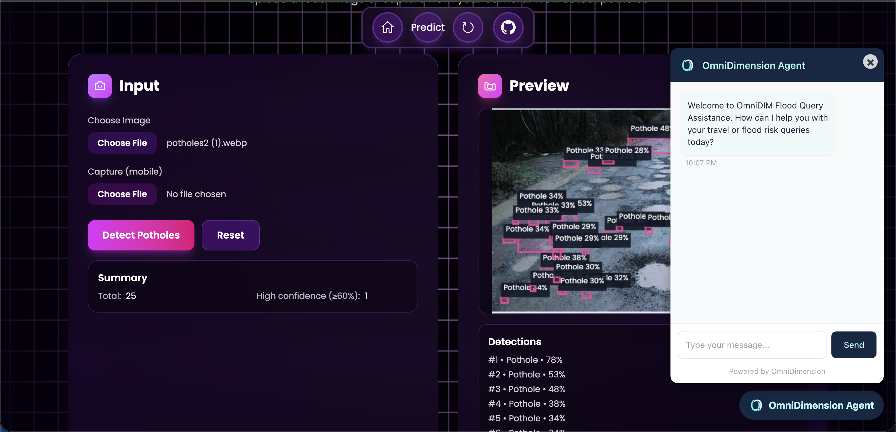
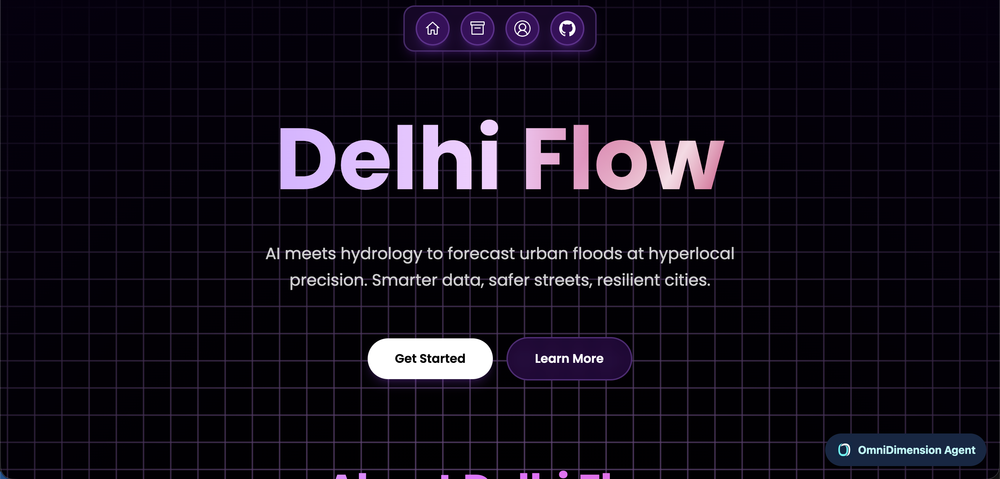
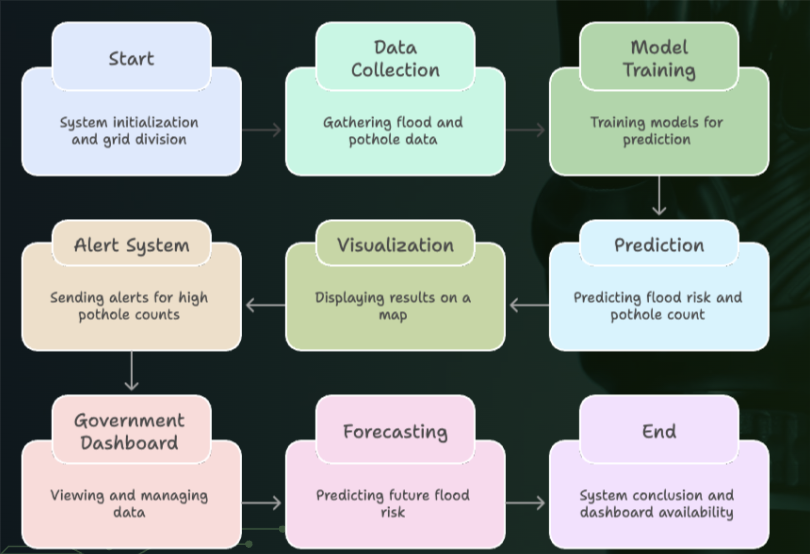
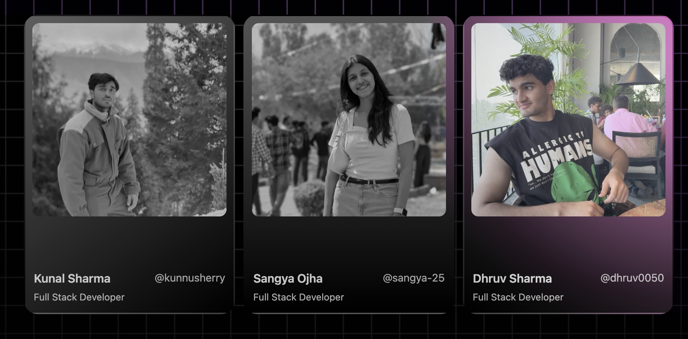

<h1 align="center">🌊 <em>Hyperlocal Urban Flood & Pothole Detection System</em> 🕳️</h1>
<p align="center">
</p>

<div align="center">



<p align="center">
  
</p>

### 🎯 *Making Delhi's Infrastructure Smarter, Safer, and More Transparent* 🎯

*An AI-driven, hyperlocal flood prediction and pothole detection system for Delhi that operates on a 7000-grid map, providing street-level insights and real-time updates.*

<p align="center">
  
  
  
  
</p>

---


</div>

## 🧩 **Problem Statement**

<div align="center">

*Urban flooding and pothole hazards have become a critical urban infrastructure issue, especially in metropolitan cities like Delhi.*

</div>

### 🌊 **Urban Flooding Crisis**

<table>
<tr>
<td width="33%">

#### 💰 **Economic Impact**
- Delhi loses **₹1,200+ crore** every monsoon
- Infrastructure damage and delays
- Business disruptions

</td>
<td width="33%">

#### 🚧 **Waterlogging Issue**
- **45% of Delhi's roads** faced waterlogging
- Over **5 hours/day** in 2023
- Traffic chaos and citizen distress

</td>
<td width="33%">

#### ⚠️ **Alert System Gap**
- City-wide alerts are too generic
- Not location-specific
- Delayed responses

</td>
</tr>
</table>

### 🕳️ **Pothole Hazards – The Hidden Aftermath**

<div align="center">

| Issue | Impact | Status |
|-------|--------|--------|
| 🔢 **Potholes Reported** | 25,000+ post-monsoon (2024) | 🔴 Critical |
| ⚠️ **Annual Deaths** | 3,500+ in India due to potholes | 🔴 Critical |
| 📝 **Reporting System** | Manual, reactive, no traceability | 🟡 Needs Fix |

</div>

### 📊 **Data Transparency & Decision-Making Gap**

- ❌ Flood alerts are manual and delayed, not predictive
- ❌ No unified system to visualize which street or colony is at risk in real-time
- ❌ Reporting is manual, reactive, and lacks spatial traceability

---

<div align="center">

</div>

## 💡 **Our Solution**

<div align="center">

### 🎯 **AI-Powered Flood & Pothole Risk Management System**

*We have developed an AI-driven, hyperlocal flood prediction and pothole detection system for Delhi that operates on a 7000-grid map, providing street-level insights and real-time updates.*

</div>

---

## 🌟 **Key Features**

<div align="center">


</div>

<table>
<tr>
<td width="50%">

### 🎯 **Street-Level Intelligence**
Predicts flood risk at street-by-street level, not just city-wide.

</td>
<td width="50%">

### 🔮 **Predictive, Not Reactive**
AI forecasts waterlogging before it happens, unlike Google / DDMA.

</td>
</tr>
<tr>
<td width="50%">

### 🕳️ **Integrated Pothole + Flood Intelligence**
Combines pothole & flood data for comprehensive road safety insights.

</td>
<td width="50%">

### 🤖 **AI-Powered Communication Layer**
Omnidimension chatbot + call automation to alert authorities instantly.

</td>
</tr>
</table>

---

## 🧠 **1️⃣ Flood Risk Prediction Module**

<div align="center">

### 🗺️ **7000-Grid Hyperlocal System**



</div>

### 📊 **How It Works**

<table>
<tr>
<td width="50%">

#### 🗺️ **Grid Division**
- Delhi region divided into **7000 grids**
- Each grid covers **~500 m²**
- Street-level precision

#### 🤖 **Machine Learning Model**
- Trained on **1 million+ data points**
- Predicts **High, Medium, or Low** flood risk
- **98% Accuracy**

</td>
<td width="50%">

#### 📈 **Input Features**
- 🏔️ **Elevation**
- 🛣️ **Road Density**
- 🌧️ **Rainfall** (current and past 3 hours)
- 💧 **Drain Water Level**
- 🌱 **Soil Moisture**
- ⏰ **Temporal data** (hour, day of week, month)

</td>
</tr>
</table>

### 🗺️ **Dynamic Flood Risk Map**

<div align="center">



</div>

- Integrated with a Delhi map showing all 7000 grids
- Each grid is color-coded:
  - 🔴 **High Risk**
  - 🟡 **Medium Risk**
  - 🟢 **Low Risk**
- Users can input **From → To** locations and instantly check flood safety for their route

### 🔮 **Future Flood Forecasting**

- Predictive capability for **7-day future forecasts**
- Updates dynamically as rainfall and environmental data evolve
- Real-time map updates every hour

---

<div align="center">

</div>

## 🕳️ **2️⃣ Pothole Detection Module**

<div align="center">

*We tackle potholes using dual data collection pipelines*



</div>

### 🛴 **A. IoT-based Auto Detection (E-Scooters Integration)**

<table>
<tr>
<td width="50%">

#### 🔌 **Integration**
- Integration with **Ather electric scooters**
- Uses onboard sensors
- Vibration and movement pattern analysis

</td>
<td width="50%">

#### 🎯 **Detection Flow**
1. Vibrations match pothole signatures
2. Pothole detection event triggered
3. Location logged automatically
4. **25+ potholes** → Alert to authorities

</td>
</tr>
</table>

### 📸 **B. User Image Upload Detection**

<div align="center">


</div>

<table>
<tr>
<td width="33%">

#### 📤 **Upload**
Users upload images of roads facing issues

</td>
<td width="33%">

#### 🤖 **AI Analysis**
**YOLOv8 Deep Learning Model** analyzes the image to detect potholes

</td>
<td width="33%">

#### 💾 **Storage**
- Geolocation stored
- Pothole count recorded
- Delhi map updates dynamically

</td>
</tr>
</table>

---

## 💬 **3️⃣ Chatbot & Communication System**

<div align="center">



</div>

### 🤖 **Smart Chatbot Features**

<table>
<tr>
<td width="50%">

#### 💬 **User Queries**
- Quick queries regarding flood reports
- Pothole status information
- Real-time grid condition updates

</td>
<td width="50%">

#### 📞 **Emergency Contact**
- Direct call feature
- Instant contact with civic authorities
- Emergency response coordination

</td>
</tr>
</table>

---

<div align="center">

</div>

## 🧱 **System Architecture**

<div align="center">

### 📊 **High-Level Flow**

</div>

```
┌─────────────────────────────────────────────────────────────────┐
│                     DATA COLLECTION LAYER                        │
├─────────────────────────────────────────────────────────────────┤
│  Rainfall │ Elevation │ Drain Network │ Road Density │ Soil     │
└─────┬───────────────────────────────────────────────────────────┘
      │
      ▼
┌─────────────────────────────────────────────────────────────────┐
│                    PREPROCESSING LAYER                           │
├─────────────────────────────────────────────────────────────────┤
│        Data Cleaning │ Normalization │ Feature Engineering       │
└─────┬───────────────────────────────────────────────────────────┘
      │
      ▼
┌─────────────────────────────────────────────────────────────────┐
│                     AI/ML PREDICTION LAYER                       │
├─────────────────────────────────────────────────────────────────┤
│  RandomForest Model │ YOLOv8 Detection │ Risk Classification    │
└─────┬───────────────────────────────────────────────────────────┘
      │
      ▼
┌─────────────────────────────────────────────────────────────────┐
│                    VISUALIZATION LAYER                           │
├─────────────────────────────────────────────────────────────────┤
│     7000-Grid Map │ Color-Coded Risk │ Route Checker            │
└─────┬───────────────────────────────────────────────────────────┘
      │
      ▼
┌─────────────────────────────────────────────────────────────────┐
│                      USER INTERFACE                              │
├─────────────────────────────────────────────────────────────────┤
│   Dashboard │ Chatbot │ Call Feature │ Upload System            │
└─────────────────────────────────────────────────────────────────┘
```

### 🔄 **System Flows**

<table>
<tr>
<td width="33%">

#### 🌊 **Flood Risk Flow**
```
Raw Data
    ↓
Preprocessing
    ↓
Model Prediction
    ↓
Grid Classification
    ↓
Map Visualization
```

</td>
<td width="33%">

#### 🕳️ **Pothole Detection Flow**
```
IoT/User Upload
    ↓
YOLOv8 Model
    ↓
Detection
    ↓
Database Update
    ↓
Map Grid Update
```

</td>
<td width="33%">

#### 👤 **User Interaction Flow**
```
User
    ↓
Map Dashboard
    ↓
Route Selection
    ↓
Risk Display
    ↓
Chatbot/Call Action
```

</td>
</tr>
</table>

---

## 🧰 **Tech Stack**

<div align="center">

<table>
<tr>
<td align="center" width="20%">

<br><strong>Python</strong>
<br><em>Core Language</em>
</td>
<td align="center" width="20%">

<br><strong>Flask</strong>
<br><em>Backend API</em>
</td>
<td align="center" width="20%">

<br><strong>React.js</strong>
<br><em>Frontend</em>
</td>
<td align="center" width="20%">

<br><strong>MongoDB</strong>
<br><em>Database</em>
</td>
<td align="center" width="20%">

<br><strong>Mapbox/Leaflet</strong>
<br><em>Maps</em>
</td>
</tr>
</table>

</div>

### 📋 **Complete Technology Stack**

<table>
<tr>
<td width="50%">

#### 🧠 **Machine Learning**
- **scikit-learn** → RandomForestClassifier for flood risk prediction
- **YOLOv8** → Deep learning model for pothole detection
- **pandas, numpy** → Data preprocessing and feature engineering
- **matplotlib, seaborn** → Data visualization and analysis

#### 🧮 **Data Sources**
- Historical rainfall data
- Digital Elevation Models (DEM)
- Soil Moisture Index
- Storm Drain Network Data
- Road Density (GIS layers)

</td>
<td width="50%">

#### 💻 **Backend**
- **Flask (Python)** → API endpoints for model predictions and pothole processing
- **MongoDB** → Stores user reports, pothole data, and flood prediction results

#### 🌐 **Frontend**
- **React.js / HTML / CSS / JS** → Dynamic dashboard for map visualization
- **Leaflet.js / Mapbox API** → For real-time Delhi map grid visualization
- **Chart.js / D3.js** → To show rainfall, drainage, and pothole statistics

#### 🧩 **Others**
- **Google Maps API** → For route visualization
- **Twilio / WebRTC** → For authority call feature
- **Dialogflow / Rasa** → For chatbot integration

</td>
</tr>
</table>

---

<div align="center">

</div>

## 🚀 **Uniqueness & Feasibility**

<div align="center">

| Aspect | Description |
|--------|-------------|
| 🎯 **Hyperlocal Forecasting** | First model to operate at **500m² grid resolution** for Delhi — providing street-level predictions |
| 🎯 **Accuracy** | Achieved **98% model accuracy** on 1 million+ records |
| 🔌 **Dual Detection System** | Combines **IoT + Computer Vision** for real-time pothole detection |
| 📊 **Transparency** | Publicly viewable pothole & flood data, encouraging civic accountability |
| 📈 **Scalability** | Model can be easily adapted to other Indian cities using similar data layers |
| ⚡ **Real-Time Updating** | Map updates every hour using live data streams |
| 👥 **User-Centric Design** | From-to flood-safe route checking + chatbot + authority call for seamless interaction |

</div>

---

## 📸 **System Screenshots**

<div align="center">

### 🗺️ **Dashboard & Map View**

| 📊 **Main Dashboard** | 🗺️ **7000-Grid Map** |
|:---------------------:|:---------------------:|
|  |  |
| *Real-time risk overview* | *Color-coded flood zones* |

</div>

<div align="center">

### 🕳️ **Pothole Detection System**

| 📸 **Image Upload** | 🤖 **AI Detection** |
|:-------------------:|:-------------------:|
|  |  |
| *User upload interface* | *YOLOv8 analysis results* |

</div>

<div align="center">

### 💬 **Communication Features**

| 🤖 **Chatbot** | 📞 **Emergency Call** |
|:--------------:|:---------------------:|
|  | |
| *AI assistant interface* | *Direct authority contact* |

</div>

<div align="center">

### 📈 **Analytics & Reports**

| 📊 **Flood Analytics** | 🕳️ **Pothole Heatmap** |
|:----------------------:|:-----------------------:|
| |
| *Historical data trends* | *High-risk zone visualization* |

</div>

---

## 🔮 **Future Scope**

<div align="center">

<table>
<tr>
<td width="33%">

#### 🌍 **Phase 1**
- Integration with **IoT rain gauges**
- Real-time drain sensors
- Live data stream processing

</td>
<td width="33%">

#### 🚀 **Phase 2**
- **Pan-India** flood prediction
- Regional model adaptation
- Multi-city deployment

</td>
<td width="33%">

#### 🔬 **Phase 3**
- Predictive maintenance alerts
- DDMA integration
- Advanced ML models

</td>
</tr>
</table>

</div>

### 🎯 **Planned Enhancements**

- ✅ Integration with IoT rain gauges and drain sensors for real-time input data
- ✅ Expansion to Pan-India flood prediction using regional models
- ✅ Predictive Maintenance alerts for roads with high recurring pothole counts
- ✅ Integration with Delhi Disaster Management Authority (DDMA) for early warnings

---

## 🧾 **Model Export & Deployment**

<div align="center">

### 📦 **Exported Artifacts**

</div>

We exported the following artifacts for smooth deployment:

<table>
<tr>
<td width="33%" align="center">

#### 🤖 **model.pkl**
Trained RandomForest flood model

</td>
<td width="33%" align="center">

#### 📊 **scaler.pkl**
StandardScaler for normalization

</td>
<td width="33%" align="center">

#### 🏷️ **label_encoder.pkl**
For categorical flood labels (Low, Medium, High)

</td>
</tr>
</table>

<div align="center">

*Deployed via Flask backend and accessible through the dashboard API*

</div>

---

## 📊 **Visual Representation**

<div align="center">



</div>

### 🎨 **Key Visualizations**

- 🗺️ **Dynamic Delhi Grid Map** (7000 zones) — color-coded flood risk visualization
- 🕳️ **Overlay of pothole detection markers** with live counts
- 💬 **Interactive chatbot** & alert panel for immediate actions
- 📈 **Real-time analytics dashboard** with statistics and trends

---

## 🚀 **How to Run Locally**

<div align="center">

</div>

### 📥 **1. Clone the repository**

```bash
git clone <your-repo-link>
cd flood-pothole-detection
```

### 📦 **2. Install dependencies**

```bash
# Backend dependencies
pip install -r requirements.txt

# Frontend dependencies
cd frontend && npm install
```

### 🔐 **3. Environment Configuration**

Create a `.env` file in the backend folder:

```ini
# Database
MONGO_URI=your_mongodb_connection_string

# API Keys
MAPBOX_API_KEY=your_mapbox_key
GOOGLE_MAPS_API_KEY=your_google_maps_key
TWILIO_API_KEY=your_twilio_key

# Model Paths
MODEL_PATH=./models/model.pkl
SCALER_PATH=./models/scaler.pkl
LABEL_ENCODER_PATH=./models/label_encoder.pkl
```

### 🚀 **4. Run the application**

```bash
# Start backend server
python app.py

# Start frontend (in separate terminal)
cd frontend && npm start
```

<div align="center">

🎉 **Open in browser:** `http://localhost:3000`

</div>

---
## 🤝 **Contributing**

<div align="center">


</div>

### 🎯 **How to Contribute**
<div align="center">



</div>

1. **🍴 Fork** the repository
2. **🌿 Create** a feature branch
   ```bash
   git checkout -b feature/amazing-feature
   ```
3. **💻 Commit** your changes
   ```bash
   git commit -m "✨ Add amazing feature"
   ```
4. **📤 Push** to the branch
   ```bash
   git push origin feature/amazing-feature
   ```
5. **🔄 Open** a Pull Request

---

## 📄 **License**

<div align="center">

This project is licensed under the **MIT License** - see the [LICENSE](LICENSE) file for details.


</div>

---

## 🏁 **Conclusion**

<div align="center">

*This project provides a data-driven, citizen-integrated solution for urban flood management and pothole detection — making Delhi's infrastructure smarter, safer, and more transparent.*

*By combining AI, IoT, and real-time visualization, we empower both citizens and authorities to act proactively rather than reactively.*

</div>

---

<div align="center">


### ⭐ **If you found this project helpful, please consider giving it a star!** ⭐


</div>